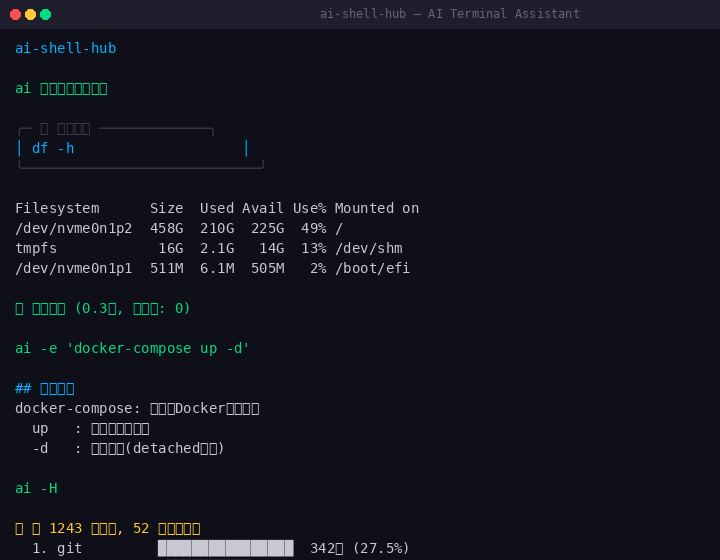
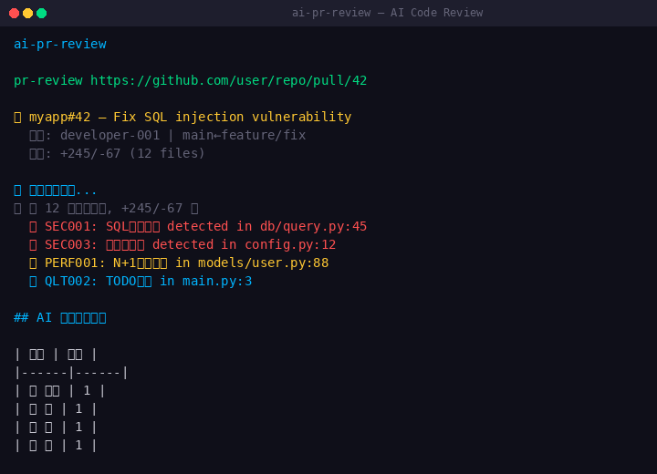
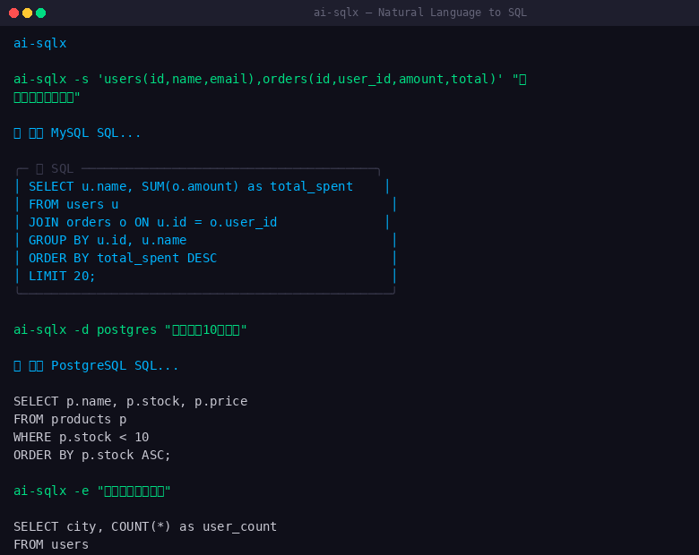
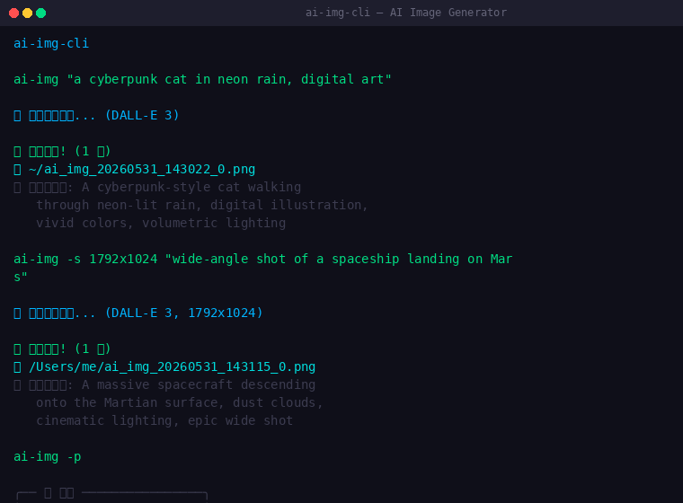

# AI Tools

A collection of command-line AI tools for developers. Each tool solves a
specific problem: working with the shell, reviewing code, writing SQL, or
generating images. Tools are installed individually via pip.

[](https://pypi.org/project/ai-shell-hub/)
[](https://pypi.org/project/ai-pr-review/)
[](https://pypi.org/project/ai-sqlx/)
[](https://pypi.org/project/ai-img-cli/)
[](LICENSE)

---

## Tools Included

| Package | Command | Description |
|---------|---------|-------------|
| [ai-shell-hub](https://pypi.org/project/ai-shell-hub/) | `ai` | Translate natural language to shell commands. Diagnose errors. |
| [ai-pr-review](https://pypi.org/project/ai-pr-review/) | `pr-review` | Automated code review with pattern-based security scanning. |
| [ai-sqlx](https://pypi.org/project/ai-sqlx/) | `ai-sqlx` | Translate natural language to SQL queries. |
| [ai-img-cli](https://pypi.org/project/ai-img-cli/) | `ai-img` | Generate images from text prompts via DALL-E 3. |

Each tool has a free tier (limited daily use) and a Pro tier (unlocked via
license activation).

---

## Installation

Each tool is a separate pip package:

```bash
pip install ai-shell-hub
pip install ai-pr-review
pip install ai-sqlx
pip install ai-img-cli
```

Python 3.10+ required.

---

## Prerequisites

### LLM API Key (Required)

The tools use OpenAI's API for natural language processing. You need an
OpenAI API key with access to `gpt-4o-mini` or similar models.

```bash
export OPENAI_API_KEY="sk-..."
ai --config   # configure the key
```

You are responsible for any API usage costs charged by OpenAI.

### Etherscan API Key (Required for License Activation)

License activation verifies USDT payments via the Etherscan API. A free API
key is available at [etherscan.io](https://etherscan.io/myapikey).

```bash
export ETHERSCAN_API_KEY="YourApiKey"
```

---

## Configuration

Each tool stores configuration in `~/.<tool-name>/config.json`.

```bash
ai --config       # ai-shell-hub
ai-sqlx --config  # ai-sqlx
ai-img --config   # ai-img-cli
pr-review --config  # ai-pr-review
```

---

## Usage Examples

### ai-shell-hub

```bash
ai "show disk usage"
ai -e "docker-compose up -d"
ai -f "docker: command not found"
ai -H
```

### ai-pr-review

```bash
pr-review https://github.com/owner/repo/pull/123
pr-review https://github.com/owner/repo/pull/123 --deep
```

### ai-sqlx

```bash
ai-sqlx "find users who registered in the last 7 days"
ai-sqlx -d postgres "total orders per customer"
```

### ai-img-cli

```bash
ai-img "a cat in space wearing a hoodie"
ai-img -s 1792x1024 "wide landscape"
ai-img -o output.png "your prompt"
```

---

## Screenshots






---

## Pro License Activation

The Pro tier is unlocked via a one-time license activation that uses a USDT
(ERC20) transfer verified against the Ethereum blockchain.

### Supported Tiers

| Tier | Price (USDT) | Scope |
|------|-------------|-------|
| Shell Hub Pro | $7 | No daily usage limit |
| PR Review Pro | $7 | No daily usage limit |
| SQL Pro | $7 | No daily usage limit |
| Image CLI Pro | $4 | No daily usage limit |
| Bundle | $10 | All four tools |

### Payment Address

Network: ERC20 (Ethereum)
Address: `0xafc32581a9e4ea30aa03cb8ef5879c2366d35f46`

**Important notes:**
- Send only USDT on the ERC20 network. Other networks or tokens may be lost.
- Transactions are irreversible. Verify the address and network before sending.
- The project does not custody or manage user funds.
- Activation is local and does not transmit personal data.

### Activation Commands

```bash
# ai-shell-hub
ai claim <transaction_hash>

# ai-pr-review
pr-review --claim <transaction_hash>

# ai-sqlx
ai-sqlx claim <transaction_hash>

# ai-img-cli
ai-img claim <transaction_hash>
```

Activation produces a deterministic activation code derived from the
transaction. No remote server is contacted for activation.

---

## Security Considerations

### Shell Commands

- Dangerous patterns (rm -rf /, dd, mkfs, fork bombs) are blocked.
- Destructive operations require explicit user confirmation.
- Commands are classified as read/write/search/destructive before execution.

### Code Review

- Rule-based scanning only. Not a substitute for professional security audit.
- Does not execute code or connect to external services (unless deep LLM
  review is explicitly enabled).

### SQL Generation

- Default mode generates SQL only; does not connect to databases.
- Destructive statements (DROP, DELETE, UPDATE, ALTER) are blocked.
- Users should never connect to production databases without manual review.

### Image Generation

- Uses OpenAI DALL-E 3. Users must comply with OpenAI's content policy.
- API costs are billed by OpenAI directly.

---

## Privacy

- Tools run locally. No telemetry or usage data is collected.
- LLM queries are sent to OpenAI (or your configured provider).
- Etherscan API calls query public blockchain data.
- No analytics, no tracking, no background telemetry.

---

## Limitations

- Requires internet access for LLM and Etherscan API calls.
- PR review uses pattern matching; may miss issues.
- SQL quality depends on the LLM model and schema information.
- Image generation requires an OpenAI API key with DALL-E 3 access.
- Maintained by a single developer; response times may vary.

---

## Responsible Use

Users agree to:

1. Review AI-generated content before acting on it.
2. Not use these tools for illegal or malicious purposes.
3. Comply with third-party API terms of service.
4. Not bypass or redistribute the license activation system.

---

## Development

```bash
git clone https://github.com/autogz/ai-tools.git
cd ai-tools
# Each tool has its own directory:
#   shell-hub/ (pypi: ai-shell-hub)
#   pr-review/ (pypi: ai-pr-review)
#   sqlx/      (pypi: ai-sqlx)
#   img-cli/   (pypi: ai-img-cli)
```

---

## License

MIT License. See [LICENSE](LICENSE).

## Disclaimer

See [DISCLAIMER.md](DISCLAIMER.md) for legal, security, and usage disclaimers.

## Security

See [SECURITY.md](SECURITY.md) for reporting vulnerabilities.

## Code of Conduct

See [CODE_OF_CONDUCT.md](CODE_OF_CONDUCT.md).
