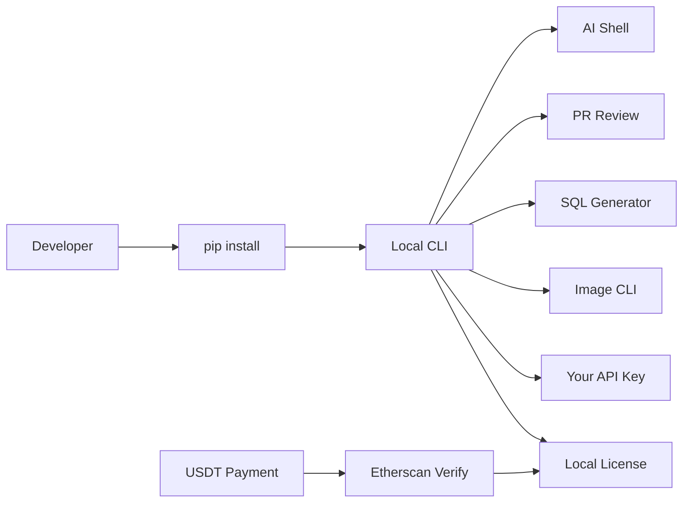
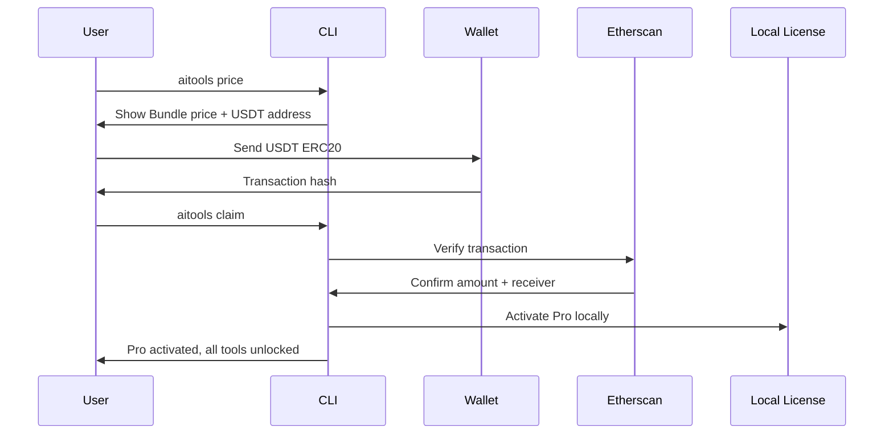
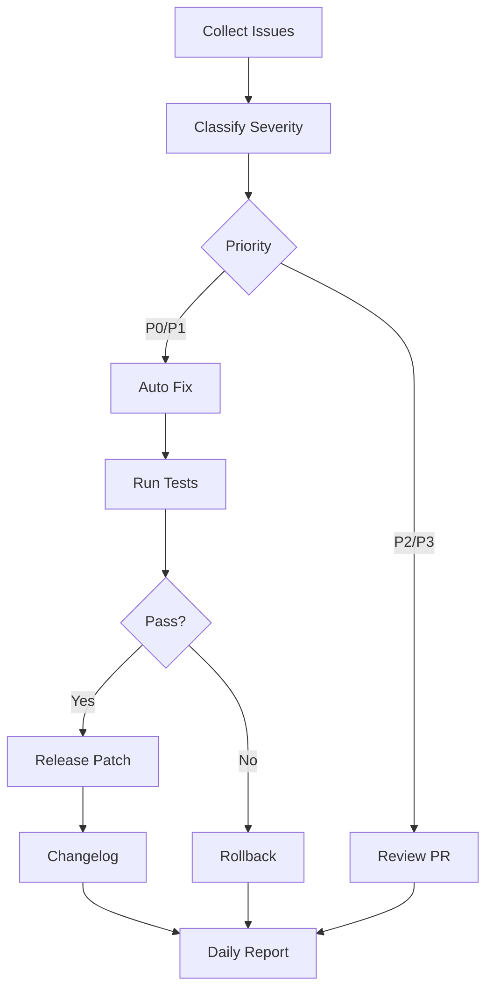
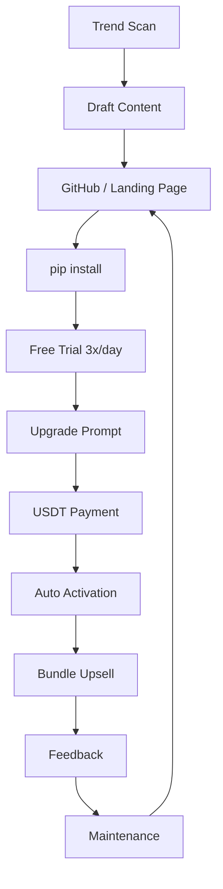

# AI Developer Tools Bundle

A local-first AI CLI toolkit for developers. Shell commands, PR reviews, SQL
generation, and image generation in one terminal. Bring your own API key.
Pay once. Use forever.

[](https://pypi.org/project/ai-shell-hub/)
[](LICENSE)

---

## Tools Included

| Package | Install | What it does |
|---------|---------|-------------|
| **AI Shell Hub** | `pip install ai-shell-hub` | Natural language to shell commands, error diagnosis |
| **AI PR Review** | `pip install ai-pr-review` | Automated code review with security pattern scanning |
| **AI SQL** | `pip install ai-sqlx` | Natural language to SQL (MySQL, PostgreSQL, etc.) |
| **AI Image CLI** | `pip install ai-img-cli` | Image generation via DALL-E 3 from terminal |

Each tool has a free tier. The **Bundle** unlocks all four Pro tiers.

---

## Quick Install

```bash
# Install individual tools
pip install ai-shell-hub
pip install ai-pr-review
pip install ai-sqlx
pip install ai-img-cli

# Configure your API key
export OPENAI_API_KEY="sk-..."
ai --config
```

---

## Usage Examples

### AI Shell Hub

```bash
ai "show disk usage"
ai -e "docker-compose up -d"
ai -f "docker: command not found"
ai -H
```

### AI PR Review

```bash
pr-review https://github.com/example/repo/pull/123
pr-review https://github.com/example/repo/pull/123 --deep
```

### AI SQL

```bash
ai-sqlx "find users who registered in the last 7 days"
ai-sqlx -d postgres "total orders per customer"
```

### AI Image CLI

```bash
ai-img "a cat in space wearing a hoodie"
ai-img -s 1792x1024 "wide landscape"
```

---

## Pricing

| Tier | Price | Scope |
|------|-------|-------|
| **Bundle** (recommended) | **$10 lifetime** | All 4 tools |
| Shell Hub Pro | $7 lifetime | Shell AI only |
| PR Review Pro | $7 lifetime | Code review only |
| SQL Pro | $7 lifetime | SQL generation only |
| Image CLI Pro | $4 lifetime | Image generation only |
| Free | $0 | 3 calls/day across all tools |

---

## Payment and Activation

### Payment Address

```
Network: ERC20 (Ethereum)
Asset:   USDT
Address: 0xafc32581a9e4ea30aa03cb8ef5879c2366d35f46
```

**Important:**
- Send only USDT on the **ERC20** network. Other networks may result in loss.
- Transactions are irreversible. Verify the address before sending.
- This project does not custody user funds.
- Payment purchases a local software license, not a service subscription.

### Activation

After sending USDT, run the claim command with your transaction hash:

```bash
# Bundle (all 4 tools)
aitools claim <tx_hash>

# Individual tools
ai claim <tx_hash>
pr-review --claim <tx_hash>
ai-sqlx claim <tx_hash>
ai-img claim <tx_hash>
```

The CLI queries the Etherscan API to verify the transaction, then generates
a local activation key. No remote server is involved in activation.

### Free Tier

You get 3 free calls per day across all tools. After that:

```
You have used your free runs for today.

Upgrade to AI Developer Tools Bundle:
- AI Shell
- AI PR Review
- AI SQL
- AI Image CLI

Price: $10 lifetime
Payment: USDT ERC20 / Alipay / WeChat
Run: aitools price

Already paid?
Run: aitools claim <tx_hash>
```

---

## Architecture



## Payment Flow



## Auto-Maintenance Loop



## Revenue Loop



---

## Privacy

- All tools run **locally**. No telemetry, analytics, or usage data is collected.
- LLM queries are sent to OpenAI (or your configured provider). Your API key
  is stored locally and never transmitted to this project.
- Etherscan API calls query public blockchain data only.
- No user code is uploaded unless you explicitly enable a remote model API.

---

## Security

- Shell commands are classified as read/write/search/destructive before
  execution. Dangerous patterns (`rm -rf /`, `dd`, `mkfs`, fork bombs,
  `curl | bash`) are blocked.
- Destructive operations require explicit user confirmation.
- SQL tool generates queries only; it does not execute them by default.
  Destructive SQL (`DROP`, `DELETE`, `UPDATE`, `ALTER`) is blocked.
- PR Review uses rule-based pattern matching. Results are **advisory only**
  and do not substitute for professional security audit.
- API keys are stored locally in `~/.<tool-name>/config.json`.

---

## Limitations and Disclaimer

- AI-generated output may contain errors. Users must review before acting.
- PR Review uses pattern matching; it will not catch all bugs or vulnerabilities.
- SQL quality depends on the LLM model and schema information provided.
- Image generation requires an OpenAI API key with DALL-E 3 access. API costs
  are billed by OpenAI.
- License activation requires internet access for Etherscan API queries.
- This project is maintained by a solo developer. Response times may vary.

See [DISCLAIMER.md](DISCLAIMER.md) for full legal disclaimers.

---

## FAQ

**Q: Do I need an API key?**
A: Yes. Each tool requires an OpenAI API key (or compatible provider). Set it
via `ai --config` or the `OPENAI_API_KEY` environment variable.

**Q: What if I send USDT on the wrong network?**
A: Only ERC20 is supported. Transactions on other networks (BSC, Solana,
TRC20) may be lost.

**Q: Is my payment refundable?**
A: All blockchain transactions are irreversible. Please verify the address
and network before sending.

**Q: What happens after I pay?**
A: Run `aitools claim <tx_hash>`. The CLI verifies the transaction on
Etherscan and activates Pro locally.

**Q: Can I use the tools offline?**
A: LLM features require internet. Shell command classification and basic
error diagnosis work offline.

**Q: Do you collect my data?**
A: No. All tools run locally. No telemetry, no analytics, no tracking.

---

## Development

```bash
git clone https://github.com/autogz/ai-tools.git
cd ai-tools
# Each tool has its own directory with a venv
```

## License

MIT License. See [LICENSE](LICENSE).

## Security

Report vulnerabilities via [SECURITY.md](SECURITY.md).

## Code of Conduct

See [CODE_OF_CONDUCT.md](CODE_OF_CONDUCT.md).
